# Long Method 超長的方法
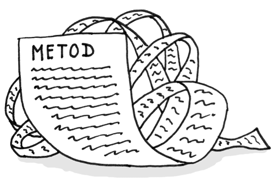

一個方法包含了太多的程式碼行。一般來說，任何超過十行的方法都會讓你開始提問。

* 要減少方法的長度, 請使用 "Extract Method".
* 如果局部變量和參數干擾提取方法, 請使用 "Replace Temp with Query", "Introduce Parameter Object", "Preserve Whole Object"
* 假如沒辦法用上述的方法, 請嘗試使用 "Replace Method with Method Object" 將整個方法移動到單獨的物件。
* 對於If 條件，請使用 "Decompose Conditional"。試著將迴圈loop 內的程式碼嘗試進行 "Extract Method"。


# Large Class 超大物件


* 如果超大物件的部分行為可以分解為一個單獨的元件，則 "Extract Class" 可以提供幫助。
* 如果超大物件的部分行為可以以不同的方式實現，或者在極少數情況下使用，則 "Extract Subclass" 可以提供幫助。
* 如果需要獲取客戶端可以使用的操作和行為的列表，"Extract Interface" 可以提供幫助。
* 如果一個大物件負責圖形界面，你可以嘗試將其一些數據和行為移動到一個單獨的域對象。在這樣做時，可能需要將一些數據的副本存儲在兩個地方，並保持數據的一致性。重複觀測資料提供了一種方法來做到這一點。


# Primitive Obsession 原始痴迷
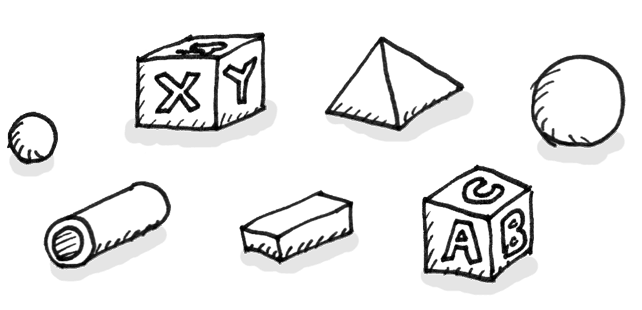

症狀
* 使用基本元素代替簡單任務的小對象（例如貨幣，範圍，電話號碼的特殊字符串等）
* 使用常量來程式碼信息（例如USER_ADMIN_ROLE = 1用於引用具有管理員權限的用戶的常量）。
* 使用字符串常量作為在數據數組中使用的欄位名稱。

治療
* 如果你有各種各樣的原始欄位，可以將它們中的一些邏輯分組到他們自己的物件中。對於這個任務，嘗試用 "Replace Data Value with Object" 。
* 如果在方法參數中使用了原始欄位的值，請使用 "Introduce Parameter Object" 或 "Reserve Whole Object" 。
* 當複雜的數據變量進行程式碼，可使用 "Replace Type Code with Class" 用物件替換程式碼，"Replace Type Code with Subclasses" 用子物件替換程式碼, 或 "Replace Type Code with State/Strategy" 用狀態/策略替換程式碼。
* 如果變量中有數組，請使用 "Replace Array with Object" 。


# Long Parameter List 超長的參數列表
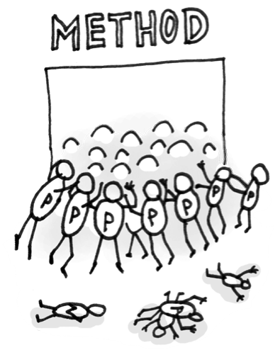

一個方法有三個或四個參數以上。

* 檢查傳遞給參數的值。如果某些參數只是另一個物件的方法呼叫的結果，請使用 "Replace Parameter with Method Call" , 或者作為一個方法參數傳遞。
* 不是將從另一個物件接收到的一組數據作為參數傳遞，而是使用"Preserve Whole Object" 將該物件本身傳遞給該方法。
* 如果有幾個不相關的數據元素，有時可以通過 "Introduce Parameter Object" 將它們合併到單個參數物件中。


# Data Clumps 資料泥塊

有時程式碼的不同部分包含相同的變量組（例如連接到數據庫的參數）。這些資料塊應該變成他們自己的物件。

* 如果重複的數據包含一個物件的欄位，請使用 "Extract Class" 將這些欄位移動到它們自己的物件中。
* 如果在方法的參數中傳遞相同的數據塊，則使用 "Introduce Parameter Object" 將它們設置為物件。
* 如果某些數據傳遞給其他方法，則考慮將整個數據對像傳遞給方法而不是單個欄位。"Reserve Whole Object" 將有助於此。


# Switch Statements 切換命令語句

* 要隔離 switch 並將其放在正確的物件中，可能需要 "Extract Method" ，然後 "Move Method"。
* 如果 switch 是基於物件程式碼的，例如當程序的運行時模式被切換時，使用 "Replace Type Code with Subclasses" ，或者用 "Replace Type Code with State/Strategy"。
* 在指定繼承結構之後，"Replace Conditional with Polymorphism" 用多態性替換條件。
* 如果條件不是太多，他們都呼叫不同參數的方法，那麼多態將是多餘的。如果出現這種情況，可以使用 "Replace Parameter with Explicit Method" 顯式方法替換參數將該方法分解為多個更小的方法，並相應地更改 switch。
* 如果其中一個條件選項是null使用 "Introduce Null Object" 引入空物件。


# Temporary Field 暫存欄位
只有在某些情況下，暫存欄位才會獲得它們的值。在這些情況之外，他們是null。

* 暫存欄位和在其上運行的所有程式碼可以通過 "Extract Class" 放在單獨的物件中。換句話說，你也可以使用 "Replace Method with Method Object" 獲得相同的結果。
* "Introduce Null Object" 並將其集成到用於檢查Temporary Field 是否存在的條件程式碼中。


# Refused Bequest 拒絕遺贈
如果一個子物件只使用從其父輩繼承的一些方法和屬性，那麼這個層次就是非常糟糕的。不需要的方法可能會被簡單的使用或者被重新定義並拋出異常。

* 如果繼承沒有意義，並且子物件與父物件沒有什麼共同之處，則可以消除繼承來替代繼承與委派。

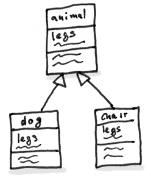

* 如果繼承是適當的，那麼就去掉子物件中不需要的欄位和方法。從父類中提取子物件所需的所有欄位和方法，將它們放在一個新的子物件中，並設置兩個物件從它繼承（Extract Superclass）。


# Alternative Classes with Different Interfaces 具有不同接口的可選物件
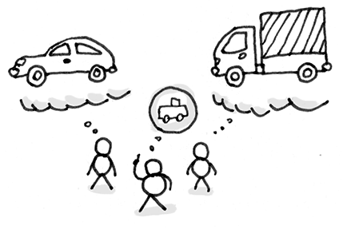

兩個物件執行相同的功能，但具有不同的方法名稱。

嘗試按照一個共同的分母來放置類的接口：
* "Rename Method" 使其在所有物件中都相同。
* "Move Method", "Add Parameter" 和 "Parameterize Method"
使方法的輸入參數和實現相同。
* 如果只有部分物件的功能是重複的，請嘗試使用 "Extract Superclass"。在這種情況下，現有的物件將成為子物件。
* 確定要使用和實施哪種處理方法後，可以刪除其中一個物件。

有時候合併物件是不可能的，或者很難做到毫無意義。一個例子是，當物件在不同的函數庫中，每個物件都有自己的版本。


# Divergent Change 發散的變化
當您對一個物件進行更改時，發現自己不得不更改很多不相關的方法。例如，添加新產品類型時，您必須更改查找，顯示和訂購產品的方法。

* 通過 "Extract Class" 分離物件的行為。
* 如果不同的物件具有相同的行為，則可能需要通過繼承（Extract Superclass 和 Extract Subclass）來組合這些物件。


# Shotgun Surgery 霰彈槍手術
霰彈槍手術類似Divergent Change發散變化，但實際上是相反的氣味。發散變化是指對一個物件進行了許多更改。散彈槍手術是指當同時對多個物件進行單一改變時。

* 使用"Move Method"和"Move Field"將現有的物件行為移動到一個物件中。如果沒有合適的物件程，請創建一個新物件。
* 如果將程式碼移到同一個物件中，原來的物件幾乎為空，請嘗試通過Inline Class去除這些冗餘物件。


# Parallel Inheritance Hierarchies 平行繼承層次結構
每當你為一個物件創建一個子物件，你就會發現自己需要為另一個物件創建一個子物件。
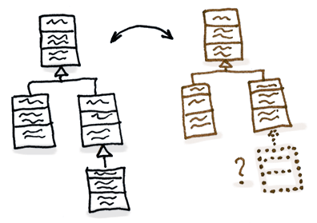

您可以分兩步去重複平行物件層次結構。首先，使一個層次結構的實例引用另一個層次結構的實例。然後，通過使用 "Move Method" 和 "Move Field"來移除引用物件中的層次結構。

> 有時並行的物件層次結構只是避免程序架構混亂的一種方式。如果您發現嘗試去重複層次結構會產生更糟糕的程式碼，那就退出，恢復所有更改並習慣該程式碼。


# Comments 註解
如果您覺得程式碼片段不能被理解為沒有註釋，請嘗試更改程式碼結構，使註釋變得不必要。

* 如果評論意圖解釋一個複雜的表達式，則表達式應該使用 “ 抽取變量” 分解為可理解的子表達式。

* 如果註釋解釋了一段程式碼，則可以通過 "Extract Method"將此部分轉換為單獨的方法。新方法的名稱很可能取自評論文本本身。

* 如果已經提取了一個方法，但是仍然需要註釋來解釋這個方法是幹什麼的，那麼給這個方法一個不言自明的名字。請使用 "Rename Method"。

* 如果需要聲明關於系統工作所需的狀態的規則，請使用 "Introduce Assertion" 引入斷言。


# Duplicate Code 重複的程式碼
兩個程式碼片段看起來幾乎相同。

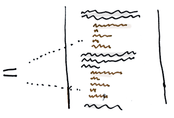

* 如果在同一個物件中的兩個或多個方法中找到相同的程式碼：使用"Extract Method" 並在兩個地方呼叫新方法。

* 如果在同一級別的兩個子物件中找到相同的程式碼:
  * 對兩個物件使用"Extract Method"，然後再使用 "Pull Up Field"。
  * 如果重複的程式碼在建構函數中，請使用"Pull Up Constructor Body"。
  * 如果重複程式碼相似但不完全相同，請使用“ 表單模板方法”。
  * 如果兩種方法做相同的事情，但使用不同的算法，選擇最好的算法，並應用替代算法。
* 如果在兩個不同的物件中找到重複的程式碼
  * 如果這些物件不是層次結構的一部分，請使用 "Extract Superclass" 為這些物件創建一個父物件，這些物件將保留所有以前的功能。
  * 如果難以或不可能創建父物件，請在一個物件中使用"Extract Class"，並在另一個物件中使用新元件。
* 如果存在大量的條件表達式並執行相同的程式碼（僅在它們的條件上不同），則使用"Consolidate Conditional Expression"合併條件表達式將這些運算符合併為單個條件，並使用"Extract Method"提取方法將條件置於單獨的方法中
* 如果在條件表達式的所有分支中執行相同的程式碼：通過使用"Consolidate Duplicate Conditional Fragments"，將相同的程式碼放在條件樹之外。


# Lazy Class 懶惰物件

也許一個物件被設計成功能完備，但是經過一些重構後，它變得非常小。或者也許是為了支持未來的開發工作而設計的。

* 對於幾乎沒有用處的元件，應該給予Inline Class處理。
* 對於功能較少的子物件，請嘗試"Collapse Hierarchy"折疊層次結構。


# Data Class 資料物件

當一個新創建的物件只包含一些公共欄位（甚至可能是一些getter / setter）時，這是正常的事情。但是物件的真正威力在於它們可以包含對數據的行為類型或操作。

* 如果某個物件包含公共欄位，則使用封裝欄位來隱藏它們，以避免直接訪問，並要求僅通過getter和setter來執行訪問。
* 使用"Encapsulate Collection" 封裝收藏存儲在集合（如數組）中的數據。


# Dead Code 死掉的程式碼

* 刪除未使用的程式碼和不需要的文件。
* 在不必要的類的情況下，如果使用子物件或父物件，則可以應用"Inline Class" 或 "Collapse Hierarchy" 折疊層次結構。
* 要刪除不需要的參數，請使用"Remove Parameter"。


# Speculative Generality 投機普遍性
有一個未使用的物件，方法，欄位或參數。

* 要除去未使用的抽像物件，請嘗試"Collapse Hierarchy"折疊層次結構。
* 通過 "Inline Class" 可以消除對其他類的不必要的功能委託。
* 未使用的方法？使用"Inline Method" 擺脫它們。
* 使用 "Remove Parameter" 的幫助，應該看看具有未使用參數的方法。


# Feature Envy 特徵羨慕
一種方法訪問另一個物件的數據比自己的數據更多。

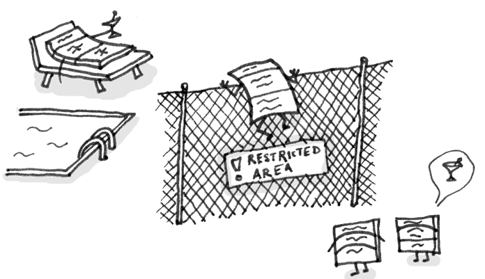

作為基本的規則，如果事情同時發生變化，你應該把它們放在同一個地方。通常使用這些數據的數據和功能一起改變。

* 如果明確的方法應該移到另一個地方，請使用"Move Method"。
* 如果只有部分方法訪問另一個對象的數據，請使用"Extract Method" 移動相關部分。
* 如果一個方法使用其他幾個物件的函數，首先要確定哪個物件包含大部分使用的數據。然後將該方法與其他數據一起放置在此物件中。或者，使用"Extract Method" 將方法拆分成可放置在不同物件中不同位置的幾個部分。


# Inappropriate Intimacy 不適當的親密關係

一個物件使用另一個物件的內部欄位和方法。

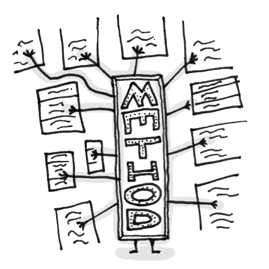

> 密切關注花費太多時間在一起的物件。好的物件應該盡可能少地了解對方。這樣的物件更容易維護和重用。

* 最簡單的解決方案是使用"Move Method"和 "Move Field"將一個物件的各個部分移動到使用這些部分的物件中。但是這只有在第一物件真的不需要這些部分時才起作用。
* 另一個解決方案是在物件上使用 "Extract Class"和 "Hide Delegate" 來使程式碼關係 “正式”。
* 如果這些物件是相互依賴的，則應該使用 "更改雙向關聯到單向"。
* 如果這個“親密關係”在子物件和父物件之間，考慮用 "Replace Delegation with Inheritance" 繼承替換委託。


# Message Chains 消息鏈

在程式碼中，您會看到一系列類似的呼叫 $a->b()->c()->d()

* 要刪除消息鏈，請使用 "Hide Delegate" 隱藏委託。
* 有時候最好考慮為什麼使用最終目標。也許這是有道理的使用"Extract Method"這個功能，透過使用"Move Method"並將其移動到鏈的開始。


# Middle Man 中間人
如果一個物件只執行一個動作，把工作委託給另一個物件，那為什麼它要存在呢？

如果一個方法的大部分物件都委託給另一個物件，那麼我們應該採用 "Remove Middle Man"。


# Incomplete Library Class 不完整的物件函數庫

當物件函數庫不再滿足用戶的需求。解決問題的唯一辦法 - 改變物件函數庫 - 但往往這是不可能的，因為物件函數庫是唯讀的。

* 要將一些方法引入到物件函數庫中，請使用 "Introduce Foreign Method" 引入外部方法。
* 對於物件函數庫中的重大更改，請使用“ 引入本地擴展”。


---
## Introduce Local Extension 引入本地擴展

實用程序物件不包含您需要的一些方法。但是你不能將這些方法添加到物件中。

那麼我們可以創建一個包含方法的新物件，並將其作為實用程序物件的子代或包裝器。


有兩種方法
* 從相關物件創建一個子物件，包含方法並繼承父物件的所有其他物件。這種方式更容易，但有時被公開物件本身阻止（由於final）。

* 創建一個包含所有新方法的新物件，其他地方將從實用物件中委託給相關對象。由於不僅需要維護包裝器和實用程序對象之間的關係的程式碼，而且還需要大量簡單的委派方法來模擬實用程序類的公開接口，因此這種方法的工作量更大。


---
## Introduce Foreign Method 引入外部方法

實用程序類不包含您需要的方法，您不能將該方法添加到類中。
那麼我們就將該方法添加到客戶端類，並將該實用類的對像作為參數傳遞給它。

```
class Report 
{
  //...
  void SendReport() 
  {
    DateTime nextDay = previousEnd.AddDays(1);
    //...
  }
}
```
## After
```
class Report 
{
  //...
  void SendReport() 
  {
    DateTime nextDay = NextDay(previousEnd);
    //...
  }
  private static DateTime NextDay(DateTime date) 
  {
    return date.AddDays(1);
  }
}
```

---
## Remove Middle Man 移除中間人
一個物件有太多的方法，只是委託給其他物件。最好是刪除這些方法並強制客戶端直接呼叫end方法。


每次將新功能添加到委託中時，都需要在服務物件中為其創建委託方法。如果做了很多改變，這將是相當煩人的。

該服務器級沒有做任何事情本身，而只是創建不必要的複雜性。在這種情況下，考慮一下這個物件是否需要。


不要刪除已經創建的中間人的原因：
* 可能已經添加了一個中間人，以避免物件之間依賴。
* 一些設計模式有目的地創建中間人（如Proxy代理和Decorator裝飾）。

---
## Replace Delegation with Inheritance 繼承替換委託

一個物件包含許多簡單的方法，委託給另一個物件的所有方法。
使該物件成為委託繼承者，這使得委託方法變得不必要。


---
## Change Bidirectional Association to Unidirectional 將雙向關聯更改為單向

你有一個物件之間的雙向關聯，但其中一個物件不使用其他的功能。


-----
## Hide Delegate 隱藏委託

客戶端從物件А的欄位或方法獲取物件B. 然後客戶端呼叫物件B的方法
應該要改為在物件A中創建一個新的方法，將呼叫委託給物件B.現在，對客戶端來說不知道或依賴於物件B。


---
## Encapsulate Collection 封裝收藏
一個物件包含一個集合欄位和一個簡單的getter和setter來處理集合。使getter-returns的值為只讀並創建添加/刪除集合元素的方法。

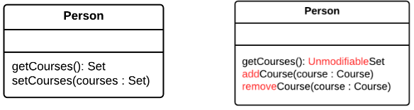

---
## Encapsulate Field 封裝欄位
```
class Person 
{
  public string name;
}
```
### After
```
class Person 
{
  private string name;

  public string Name
  {
    get { return name; }
    set { name = value; }
  }
}
```


---
## Collapse Hierarchy 折疊層次結構
你有一個物件的層次結構，其中一個子物件實際上與它的父物件相同。請合併子物件和父物件。

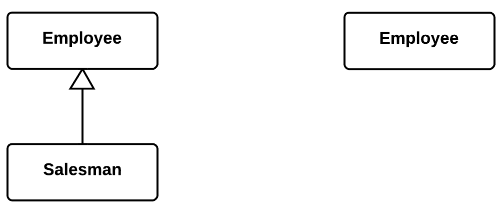


---
## Consolidate Duplicate Conditional Fragments 合併重複的條件片段

相同的程式碼可以在條件的所有分支中找到, 移動條件之外的程式碼。
```
if (IsSpecialDeal()) 
{
  total = price * 0.95;
  Send();
}
else 
{
  total = price * 0.98;
  Send();
}
```
### After
```
if (IsSpecialDeal())
{
  total = price * 0.95;
}
else
{
  total = price * 0.98;
}
Send();
```


---
## Consolidate Conditional Expression 合併條件表達式
你有多個條件導致相同的結果或行動。在一個表達式中整合所有這些條件。
```
double DisabilityAmount() 
{
  if (seniority < 2) 
  {
    return 0;
  }
  if (monthsDisabled > 12) 
  {
    return 0;
  }
  if (isPartTime) 
  {
    return 0;
  }
  // compute the disability amount
  //...
}
```
### After
```
double DisabilityAmount() 
{
  if (IsNotEligableForDisability()) 
  {
    return 0;
  }
  // compute the disability amount
  //...
}
```

---
## Substitute Algorithm 替代算法
用新算法替換實現算法的方法的主體。

```
string FoundPerson(string[] people)
{
  for (int i = 0; i < people.Length; i++) 
  {
    if (people[i].Equals("Don"))
    {
      return "Don";
    }
    if (people[i].Equals("John"))
    {
      return "John";
    }
    if (people[i].Equals("Kent"))
    {
      return "Kent";
    }
  }
  return String.Empty;
}
```
## After
```
string FoundPerson(string[] people)
{
  List<string> candidates = new List<string>() {"Don", "John", "Kent"};
  
  for (int i = 0; i < people.Length; i++) 
  {
    if (candidates.Contains(people[i])) 
    {
      return people[i];
    }
  }
  
  return String.Empty;
}
```
> 漸進式重構不是改進程序的唯一方法。有時候一個方法如此雜亂無章，更容易推倒重新開始。也許你已經找到了一個更簡單，更高效的算法。如果是這種情況，你應該簡單地用新的算法替換舊的算法。


---
## Form Template Method 表單模板方法
您的子物件按相同的順序實現包含相似步驟的算法。
將算法結構和相同的步驟移到父物件中，並在子物件中實現不同的步驟。


---
## Pull Up Constructor Body 上拉建構函數體

你的子物件具有程式碼大致相同的構造函數。
創建一個父類的構造函數，並將子物件中相同的程式碼移動到它。呼叫子物件構造函數中的父物件構造函數。

```
public class Manager: Employee 
{
  public Manager(string name, string id, int grade) 
  {
    this.name = name;
    this.id = id;
    this.grade = grade;
  }
  //...
}
```
### After
```
public class Manager: Employee 
{
  public Manager(string name, string id, int grade)
    : base(name, id)
  {
    this.grade = grade;
  }
  //...
}
```


---
## Pull Up Field 上拉欄位
兩個物件有相同的欄位, 從子物件中刪除該欄位並將其移到父物件。


---
## Introduce Assertion 引入斷言

> 這裡的斷言測試是指使用 assert() 呼叫。

要使程式碼的一部分正常工作，某些條件或值必須為真。
將這些假設替換為特定的斷言檢查。

```
double GetExpenseLimit() 
{
  // should have either expense limit or a primary project
  return (expenseLimit != NULL_EXPENSE) ?
    expenseLimit:
    primaryProject.GetMemberExpenseLimit();
}
```
### After
```
double GetExpenseLimit() 
{
  Assert.IsTrue(expenseLimit != NULL_EXPENSE || primaryProject != null);

  return (expenseLimit != NULL_EXPENSE) ?
    expenseLimit:
    primaryProject.GetMemberExpenseLimit();
}
```

> 有時候，一個異常比一個簡單的斷言更合適。您可以選擇必要的異常類，並讓剩餘的程式碼正確處理它。

> 什麼時候比一個簡單的斷言更好？如果異常可能是由用戶或系統的操作引起的，您可以處理異常。另一方面，普通的未命名和未處理的異常基本上等同於簡單的斷言 - 你不處理它們，它們完全是由於程序錯誤而導致的。


---
## Extract Variable 提取變數
假如你有一個難以理解的表達。將表達式的結果或其部分放在單獨的變量中，這些變量是不言自明的。
```
void RenderBanner() 
{
  if ((platform.ToUpper().IndexOf("MAC") > -1) &&
       (browser.ToUpper().IndexOf("IE") > -1) &&
        wasInitialized() && resize > 0 )
  {
    // do something
  }
}
```
### After
```
void RenderBanner() 
{
  readonly bool isMacOs = platform.ToUpper().IndexOf("MAC") > -1;
  readonly bool isIE = browser.ToUpper().IndexOf("IE") > -1;
  readonly bool wasResized = resize > 0;

  if (isMacOs && isIE && wasInitialized() && wasResized) 
  {
    // do something
  }
}
```

缺點
> 你的程式碼中有更多的變量。但是，這是通過輕鬆閱讀您的程式碼來抵消的。


---
## Parameterize Method
多種方法執行類似的行為，只有在它們的內部值，數字或操作上才有所不同。通過使用一個將傳遞必要的特殊值的參數來組合這些方法。

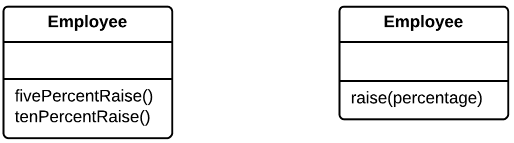

缺點
* 有時這種重構技術可能會被採用太多，導致一個漫長而復雜的常見方法，而不是多個簡單的方法。
* 將功能的激活/取消激活移動到參數時也要小心。這最終可能會導致創建一個大的條件運算符，這將需要通過 "Replace Parameter with Explicit Methods" 來處理。


---
## Add Parameter 新增參數
創建一個新的參數來傳遞必要的數據。


---
## Rename Method 重新命名方法
方法的名稱不能解釋方法的作用。重命名該方法。


---
## Introduce Null Object 引入空物件

由於有些方法返回null而不是真實的對象，所以null在程式碼中有許多檢查。返回一個空的物件，表現出默認的行為。

```
if (customer == null) 
{
  plan = BillingPlan.Basic();
}
else 
{
  plan = customer.GetPlan();
}
```
After
```
public sealed class NullCustomer: Customer 
{
  public override bool IsNull 
  {
    get { return true; }
  }
  
  public override Plan GetPlan() 
  {
    return new NullPlan();
  }
  // Some other NULL functionality.
}

// Replace null values with Null-object.
customer = order.customer ?? new NullCustomer();

// Use Null-object as if it's normal subclass.
plan = customer.GetPlan();
```


---
## Replace Parameter with Explicit Methods 用顯式方法替換參數

一個方法被分成幾個部分，每個部分根據參數的值運行。將方法的各個部分提取到自己的方法中，並呼叫它們而不是原始方法。

```
void SetValue(string name, int value) 
{
  if (name.Equals("height")) 
  {
    height = value;
    return;
  }
  if (name.Equals("width")) 
  {
    width = value;
    return;
  }
  Assert.Fail();
}
```
### After
```
void SetHeight(int arg) 
{
  height = arg;
}
void SetWidth(int arg) 
{
  width = arg;
}
```


---
## Replace Conditional with Polymorphism 用多態性替換條件


```
public class Bird 
{
  //...
  public double GetSpeed() 
  {
    switch (type) 
    {
      case EUROPEAN:
        return GetBaseSpeed();
      case AFRICAN:
        return GetBaseSpeed() - GetLoadFactor() * numberOfCoconuts;
      case NORWEGIAN_BLUE:
        return isNailed ? 0 : GetBaseSpeed(voltage);
      default:
        throw new Exception("Should be unreachable");
    }
  }
}
```
After
```
public abstract class Bird 
{
  //...
  public abstract double GetSpeed();
}

class European: Bird 
{
  public override double GetSpeed() 
  {
    return GetBaseSpeed();
  }
}
class African: Bird 
{
  public override double GetSpeed() 
  {
    return GetBaseSpeed() - GetLoadFactor() * numberOfCoconuts;
  }
}
class NorwegianBlue: Bird
{
  public override double GetSpeed() 
  {
    return isNailed ? 0 : GetBaseSpeed(voltage);
  }
}

// Somewhere in client code
speed = bird.GetSpeed();
```

---
## Move Method 移動方法

一個方法在另一個物件中比在自己的物件中更多地使用。
在使用最多方法的物件中創建一個新方法，然後將程式碼從舊方法移到那裡。將原始方法的程式碼轉換為對其他物件中的新方法的引用，否則將其全部刪除。

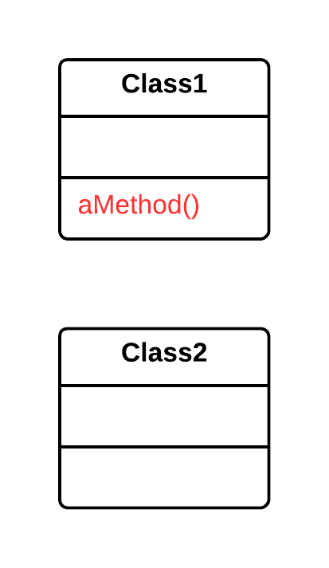
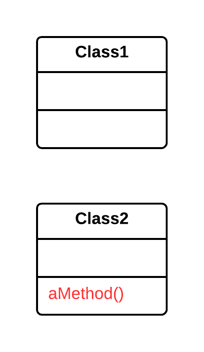


---
## Replace Parameter with Method Call 用呼叫方法替換參數

在方法呼叫之前，運行第二個方法，並將其結果作為參數發送回第一個方法。但是參數值可能是在被呼叫的方法內部獲得的。

改成將值獲取程式碼放在方法內。

```
int basePrice = quantity * itemPrice;
double seasonDiscount = this.GetSeasonalDiscount();
double fees = this.GetFees();
double finalPrice = DiscountedPrice(basePrice, seasonDiscount, fees);
```

```
int basePrice = quantity * itemPrice;
double finalPrice = DiscountedPrice(basePrice);
```


---
## Replace Array with Object 用物件替換陣列

你有一個包含各種類型數據的數組。將數組替換為每個元素都有單獨欄位的物件。

### Before
```
string[] row = new string[2];
row[0] = "Liverpool";
row[1] = "15";
```
### After
```
Performance row = new Performance();
row.SetName("Liverpool");
row.SetWins("15");
```

---
## Replace Type Code with Class 用物件替換類型

一個物件有一個包含類型程式碼的欄位。這種類型的值不在操作員的條件下使用，也不影響程序的行為。

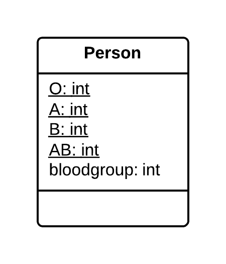

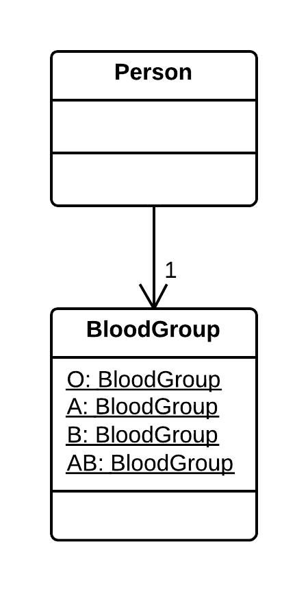


---
## Replace Type Code with Subclasses 用子物件替換類型

您有一個直接影響程序行為的程式碼類型（該欄位的值會觸發條件中的各種程式碼）。為程式碼類型的每個值創建子物件。然後將原始物件的相關行為提取到這些子物件中。用多態性替換控制流程程式碼。

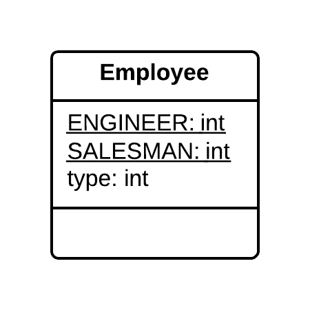

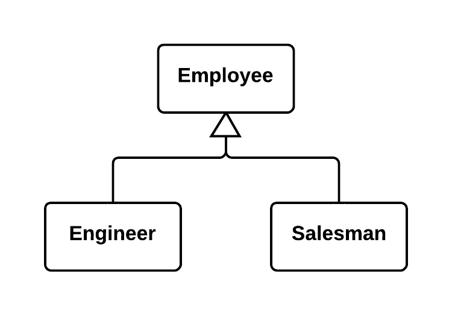


---
## Replace Type Code with State/Strategy 用狀態/策略替換類型

你有一個程式碼類型，影響行為，但你不能使用子物件來擺脫它。
用狀態對象替換類型程式碼。如果需要用類型程式碼替換欄位值，則另一個狀態對像被“插入”。


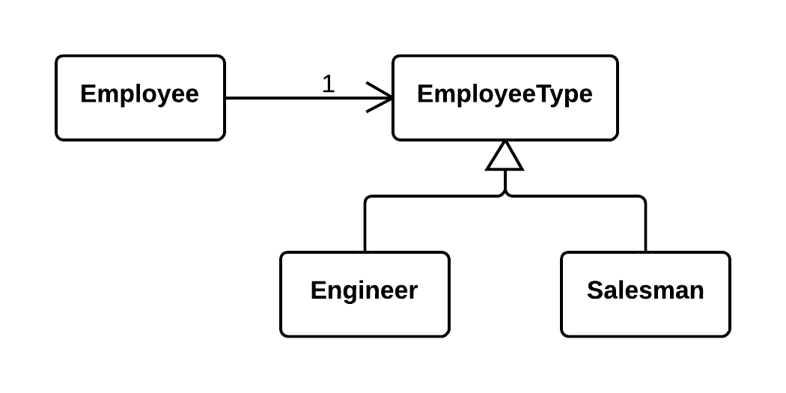

缺點
> 如果你有一個簡單的類型程式碼的情況，但是你總是使用這個重構技術，你將會有很多額外的（和不需要的）物件。


---
## Extract Method 提取方法

將此程式碼移到一個單獨的新方法（或函數），並用該方法的呼叫替換舊程式碼。
### Before

```
void PrintOwing() 
{
  PrintBanner();

  //print details
  Console.WriteLine("name: " + name);
  Console.WriteLine("amount: " + GetOutstanding());
}
```
### After
```
void PrintOwing()
{
  PrintBanner();
  PrintDetails(GetOutstanding());
}

void PrintDetails(double outstanding)
{
  Console.WriteLine("name: " + name);
  Console.WriteLine("amount: " + outstanding);
}
```

---
## Replace Temp with Query 用查詢替換暫時變數

將整個表達式移到一個單獨的方法並從中返回結果。查詢方法而不是使用變量。如有必要，將新方法合併到其他方法中。

### Before
```
double CalculateTotal() 
{
  double basePrice = quantity * itemPrice;
  
  if (basePrice > 1000) 
  {
    return basePrice * 0.95;
  }
  else 
  {
    return basePrice * 0.98;
  }
}
```
### After
```
double CalculateTotal() 
{
  if (BasePrice() > 1000) 
  {
    return BasePrice() * 0.95;
  }
  else 
  {
    return BasePrice() * 0.98;
  }
}
double BasePrice() 
{
  return quantity * itemPrice;
}
```

---
## Introduce Parameter Object 引入參數物件

將這些參數替換為一個物件。

### Before
```
amountInvoicedIn(start: Date, end:Date)
```
### After
```
amountInvoicedIn(date: DateRange)
```

---
## Preserve Whole Object 保留整個物件

嘗試傳遞整個物件。
### Before
```
int low = daysTempRange.GetLow();
int high = daysTempRange.GetHigh();
bool withinPlan = plan.WithinRange(low, high);
```
### After
```
bool withinPlan = plan.WithinRange(daysTempRange);
```

---
## Replace Method with Method Object 將方法替換為方法物件

你有一個很長的方法，局部變量交織在一起，你不能應用提取方法(Extract Method)。就將該方法轉換為一個單獨的物件，以便局部變量成為該類的欄位。然後你可以將該方法拆分成同一個物件中的幾個方法。

### Before
```
public class Order 
{
  //...
  public double Price() 
  {
    double primaryBasePrice;
    double secondaryBasePrice;
    double tertiaryBasePrice;
    // long computation.
    //...
  }
}
```
### After
```
public class Order 
{
  //...
  public double Price() 
  {
    return new PriceCalculator(this).Compute();
  }
}

public class PriceCalculator 
{
  private double primaryBasePrice;
  private double secondaryBasePrice;
  private double tertiaryBasePrice;
  
  public PriceCalculator(Order order) 
  {
    // copy relevant information from order object.
    //...
  }
  
  public double Compute() 
  {
    // long computation.
    //...
  }
}
```

---
## Decompose Conditional 分解條件

將條件的複雜部分分解為單獨的方法：條件condition, 然後then, 否則else。

### Before
```
if (date < SUMMER_START || date > SUMMER_END) 
{
  charge = quantity * winterRate + winterServiceCharge;
}
else 
{
  charge = quantity * summerRate;
}
```
### After
```
if (NotSummer(date)) 
{
  charge = WinterCharge(quantity);
}
else 
{
  charge = SummerCharge(quantity);
}
```

---
## Extract Class 提取為物件

創建一個新的物件，並將負責相關功能的欄位和方法放入其中。
如果你用這個重構技術“過度”，你將不得不求助於"Inline Class"。

### Before
```
class Person {
	string name;
	int officeAreaCode;
	string officeNumber;
	getTelephoneNumber();
}
```
### After
```
class Person {
	string name;
}

class TelphoneNumber {
	int officeAreaCode;
	string officeNumber;
	getTelephoneNumber();
}
```

---
## Inline Class 內聯物件

一個物件幾乎不做任何事情，對任何事都不負任何責任，也沒有額外的責任計劃。就乾脆放在一起就好了
### Before
```
class Person {
	string name;
}

class TelphoneNumber {
	int officeAreaCode;
	string officeNumber;
	getTelephoneNumber();
}
```
### After
```
class Person {
	string name;
	int officeAreaCode;
	string officeNumber;
	getTelephoneNumber();
}
```
---
## Extract Subclass 提取子物件

一個物件具有僅在某些情況下使用的功能。創建一個子物件並在這些情況下使用它。

### Before
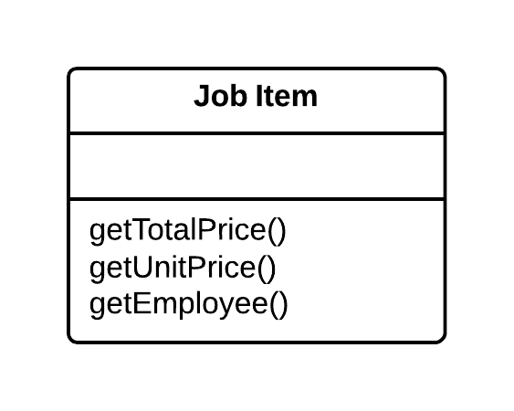

### After
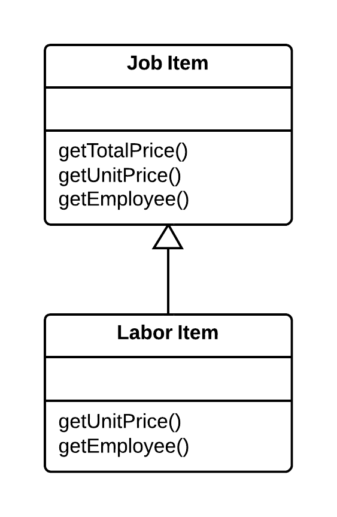


---
## Extract Interface 提取界面

多個客戶端正在使用物件接口的相同部分。另一種情況是：兩個物件的接口部分是一樣的。將這個相同的部分移到它自己的界面。

### Before
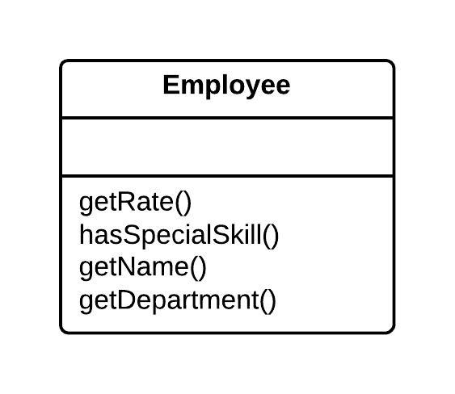

### After
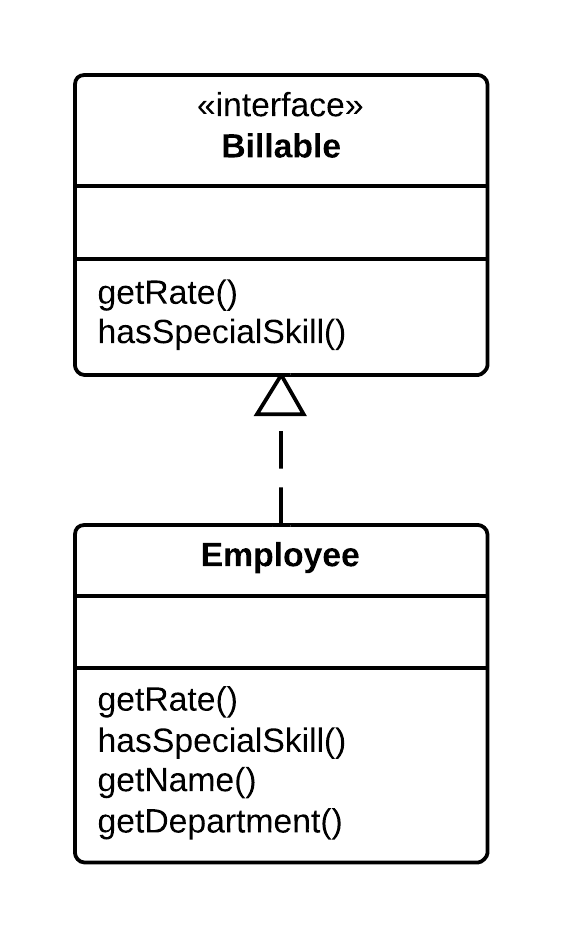

1

---
## Duplicate Observed Data 重複觀測資料
域數據是否存儲在負責GUI的類中？那麼將數據分成不同的物件是一個好主意，確保域數據和GUI之間的連接和同步。

### Before
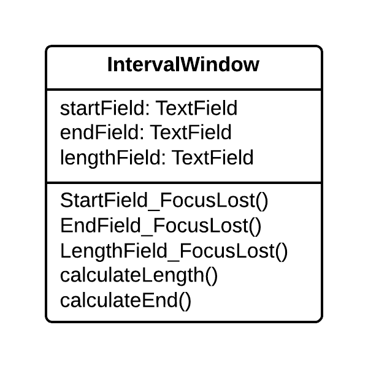

### After
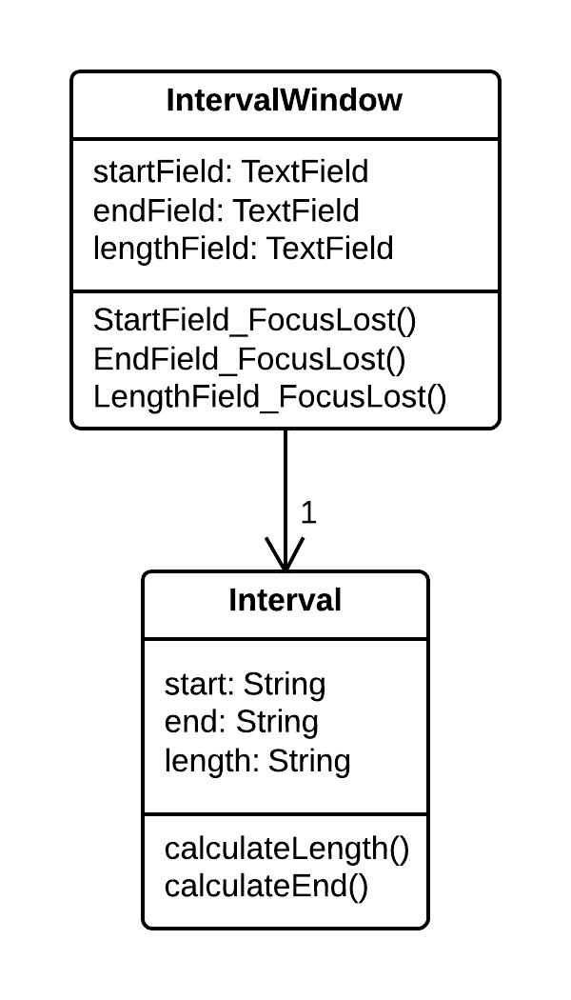


---
## Replace Data Value with Object 物件替換數據值

一個物件（或一組物件）包含一個數據欄位。該領域有自己的行為和相關的數據。創建一個新物件，將舊欄位及其行為放在物件中，並將該物件的對象存儲在原始物件中。

### Before
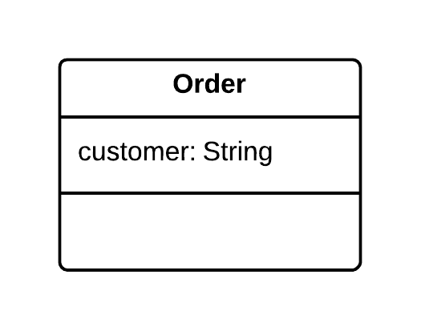

### After
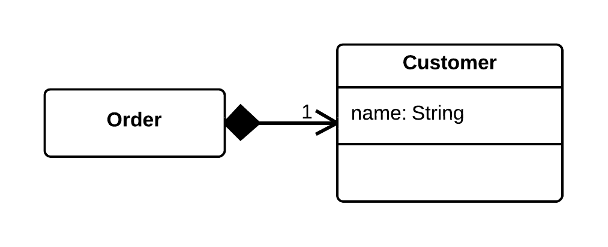