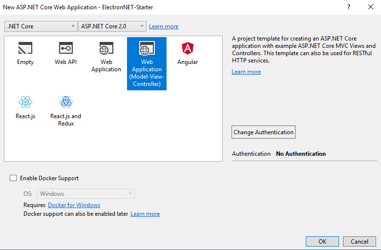
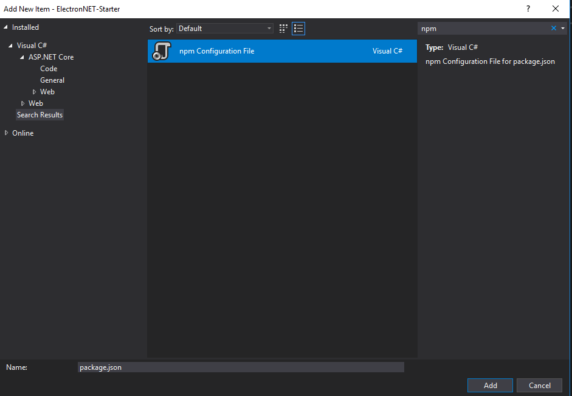
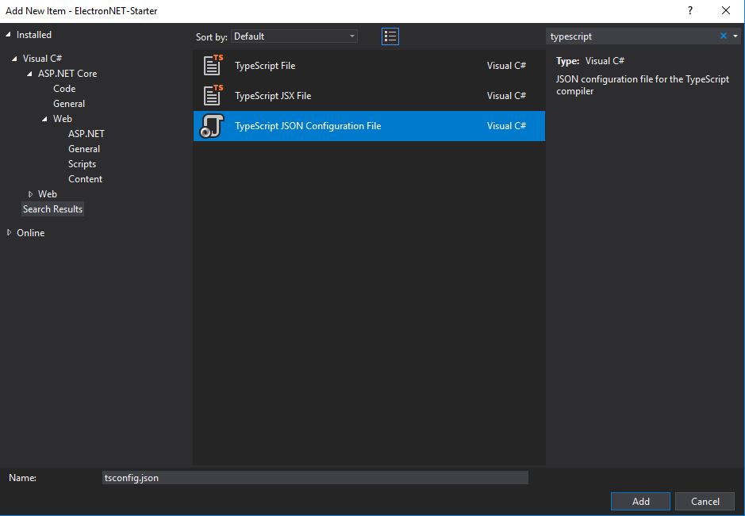

# Electron.NET 入門



建立好 ASP.NET Core 2.0 Project, 並且安裝
```
> Install-Package ElectronNET.API
```

用記事本打開xxx.csproj 專案, 在 <Project> 底下新增下面片段
```
<ItemGroup>
	<DotNetCliToolReference Include="ElectronNET.CLI" Version="0.0.6" />
</ItemGroup>
```

修改Program.cs 原始碼, 
<pre>
public static IWebHost BuildWebHost(string[] args)
{
	return WebHost.CreateDefaultBuilder(args)
		<b>.UseElectron(args)</b>
		.UseStartup&lt;Startup>()
		.Build();
}
</pre>

修改Startup.cs 原始碼
<pre>
public void Configure(IApplicationBuilder app, IHostingEnvironment env) {
	...
	app.UseMvc(routes =>
	{
		...
	});

	<b>
	// Open the Electron-Window here
	Task.Run(async () => await Electron.WindowManager.CreateWindowAsync());
	</b>
}
</pre>

在專案web 開啟command prompt 執行下面指令初始化
```
> dotnet electronize init
```

他會自動新增electron.manifest.json 檔案到專案根目錄
```
{
	"executable": "ElectronNET-Starter"
}
```

接著開始執行
```
> dotnet electronize start
```

當你clean bin, 你可以用指令回復
```
> dotnet restore
```

假如你要建立執行檔案, 以下四種指令都可以執行
```
> dotnet electronize build
> dotnet electronize build win
> dotnet electronize build osx
> dotnet electronize build linux
```
> Important! A Mac or Linux device is required to build Mac applications.


假如你遇到下面問題
```
NU1604: Project dependency ElectronNET.CLI does not contain an inclusive lower bound. Include a lower bound in the dependency version to ensure consistent restore results.
```

Try changing:
```
<ItemGroup>
	<DotNetCliToolReference Include="ElectronNET.CLI" Version="*" />
</ItemGroup>
```

to this:
```
<ItemGroup>
	<DotNetCliToolReference Include="ElectronNET.CLI" Version="0.0.6"/>
</ItemGroup>
```

接下來在專案按滑鼠右鍵(Add->New Item), 新增npm Configuration File.




將下面內容貼到 *package.json* 檔案中
```
{
	"version": "1.0.0",
	"name": "asp.net",
	"private": true,
	"devDependencies": {
		"@types/node": "^9.4.0",
		"@types/pixi.js": "^4.7.0",
		"@types/vue": "^2.0.0",
		"bootstrap": "^4.0.0",
		"bootstrap-vue": "^2.0.0-rc.1",
		"cli": "^1.0.1",
		"css-loader": "^0.28.9",
		"electron-packager": "^10.1.2",
		"grunt": "^1.0.1",
		"grunt-electron-installer": "^2.1.0",
		"jquery": "^3.3.1",
		"node-sass": "^4.7.2",
		"path": "^0.12.7",
		"pixi.js": "^4.7.0",
		"sass-loader": "^6.0.6",
		"style-loader": "^0.20.1",
		"ts-loader": "^3.4.0",
		"tsconfig-paths-webpack-plugin": "^2.0.0",
		"typescript": "^2.7.1",
		"typings": "^2.1.1",
		"vue": "^2.5.13",
		"vue-class-component": "^6.1.2",
		"vue-loader": "^14.0.3",
		"vue-property-decorator": "^6.0.0",
		"vue-router": "^3.0.1",
		"vue-template-compiler": "^2.5.13",
		"webpack": "^3.10.0",
		"webpack-merge": "^4.1.1"
	}
}
```

為了避免額外的複雜性, 在ASP.NET Core專案根目錄底下, 新增tsconfig.json



並且貼上下面全部的內容
```
{
	"compilerOptions": {
		"allowSyntheticDefaultImports": true,
		"emitDecoratorMetadata": true,
		"experimentalDecorators": true,
		"module": "es2015",
		"moduleResolution": "node",
		"target": "es2015",
		"lib": [
			"es2015",
			"es2015.promise",
			"dom"
		],
		"removeComments": true,
		"sourceMap": true,
		"skipDefaultLibCheck": true,
		"types": [ "node", "requirejs" ]
	},
	"compileOnSave": true,
	"exclude": [
		"bin",
		"node_modules"
	]
}
```

在專案根目錄下新增webpack.config.js 檔案
```
const merge = require('webpack-merge');
const baseConfig = require('../../Shared/webpack.baseConfig');
const path = require('path');

module.exports = function (env) {
	env.rootDir = __dirname;
	const isProduction = env.dev === true;

	let devConfig = merge(baseConfig(env), {
		entry: {
			app: path.join(__dirname, 'src/app.ts')
		},
		target: 'electron-renderer',
		devtool: isProduction ? 'source-map' : 'inline-source-map',
		devServer: {
			contentBase: path.join(__dirname, 'public'),
			historyApiFallback: true,
			publicPath: '/dist/'
		}
	});
	return devConfig;
};
```

下載 [WebPack Task Runner](https://marketplace.visualstudio.com/items?itemName=MadsKristensen.WebPackTaskRunner) 並且安裝

在VS.NET IDE 點取 View -> Other Windows -> Task Runner Explorer, 打開


建立vue-module.d.ts 檔案, 以便使用 .vue 檔案
```
declare module "*.vue" {
	import Vue from 'vue';
	export default typeof Vue;
}
```

假如使用Typescript 2.6 (包含)以上, 會出現下面編譯錯誤
```
Error	TS2714 (TS) The expression of an export assignment must be an identifier or qualified name in an ambient context.
```

目前只能用下面方式忽略
<pre>
declare module "*.vue" {
	import Vue from 'vue';
	<b>// @ts-ignore</b>
	export default typeof Vue;
}
</pre>
