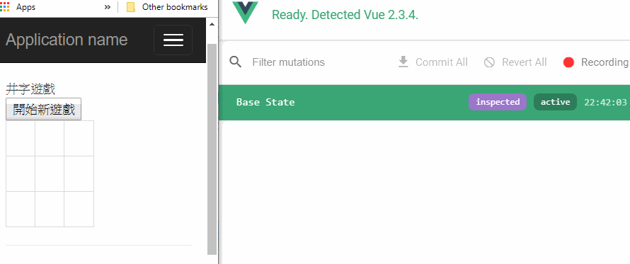

# 用ExtraVuex 寫TicTacToe 井字遊戲



趁此練習Typescript + Vue + Vuex, 首先開啟VS.NET 使用Nuget 下載

* vue 2.3.4
* vue.TypeScript.DefinitelyTyped 0.1.1
* RequireJS 2.3.3
* requirejs.TypeScript.DefinitelyTyped 0.4.4

手動下載 3rd package
* Vuex 2.3.0
* VueRouter 2.7.0
* t1
* ExtraVue

建立Index.cshtml 檔案, 並透過Requirejs 載入Boot.js 
```
<script src="~/Js/RequireConfig.js"></script>
<script src="~/Scripts/require.js" data-main="/Js/Boot.js?v=@DateTime.Now.ToString("yyyyMMddHHmmss")"></script>

<hr />
<div id="app">
</div>
```

建立Boot.js 檔案
```
define(["require", "exports", 'App'], function (require, exports, app) {
});
```

建立App.ts 開始撰寫Vue 應用程式
```
import * as VueRouter from "vue-router";
import * as Vue from "vue";
import * as ExtraVue from "ExtraVue";
import * as t1 from "t1";

Vue.use(VueRouter);
```

接著準備設計Game HTML 畫面, 所以繼續在App.ts 加上下面樣板
```
let appTemplate = `
<div>
	<span>井字遊戲</span>
	<br/>
	<button @click="startNewGame()">開始新遊戲</button>
	<br />
	<table class="table table-bordered TicTac" style="width:100px">
		<tbody>
			<tr v-for="x in 3">
				<template v-for="y in 3">
					<td @click="clickPlaid(x-1,y-1)">{{ ticMatrix[x-1][y-1] }}</td>
				</template>
			</tr>
		</tbody>
   </table>
	<span>{{ $store.state.message }}</span>
</div>
`;
```

為了讓HTML Table 大小固定, 就在Index.cshtml 中加上Style
```
<style>
	table.TicTac td {
		width: 40px;
		height: 40px;
		text-align: center;
	}
</style>
```

開始準備Vuex 架構設計這個遊戲 

> Vuex 類似React 的 Reflux

下面是設計Vue Actions 
```
enum GameActionType {
	StartNewGame,
	ClickPlaid
}
```


接著建立Vuex App 原型, 準備數個@ExtraVue.VueMethod() 方法讓View 呼叫
```
class MyApp extends ExtraVue.VueApp {

	constructor() {
		super();
	}

	getTemplate(): string {
		return appTemplate;
	}

	@ExtraVue.VueMethod()
	startNewGame() {
		this.action(GameActionType[GameActionType.StartNewGame]);
	}

	@ExtraVue.VueMethod()
	clickPlaid(x: number, y: number) {
		this.action(GameActionType[GameActionType.ClickPlaid], Pos(x, y));
	}
}
```
> 在VueApp 中, 透過this.action() 方法發送到Store.

接著設計Vue State 原型
```
class MyState {
	ticMatrix: Player[][] = createEmptyTicMatrix();
	message: string = "";
	isGameOver: boolean = false;
}
```

> 注意 Vue State 物件不可以有方法

接下來設計 Store 原型, 包含數個@ExtraVue.VuexActionMutation 專門接收action ,
最後要用commit 方法通知變更state.

```
class MyVuexStore extends ExtraVue.VuexStore {
	constructor(initState: MyState) {
		super(initState);
	}

	@ExtraVue.VuexActionMutation(GameActionType[GameActionType.StartNewGame])
	startNewGame(commit) {
		commit((state: MyState) => {
			Object.assign(self._vueObj.state, new MyState());
		});
	}

	@ExtraVue.VuexActionMutation(GameActionType[GameActionType.ClickPlaid])
	clickPlaid(commit, args: Position) {
		commit((state: MyState) => {
		});
	}

}
```

> 注意state 裡面的Array 變數如果要改變, 不可以直接用arr[index] = newValue 方式指定, 要用arr.splice(index, 1, newValue); 方式指定


完整原始碼在此 [App.ts](/ExtraVue-Images/App.ts)


