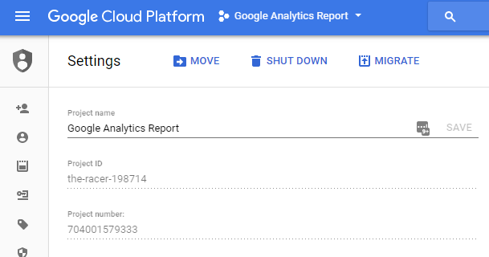
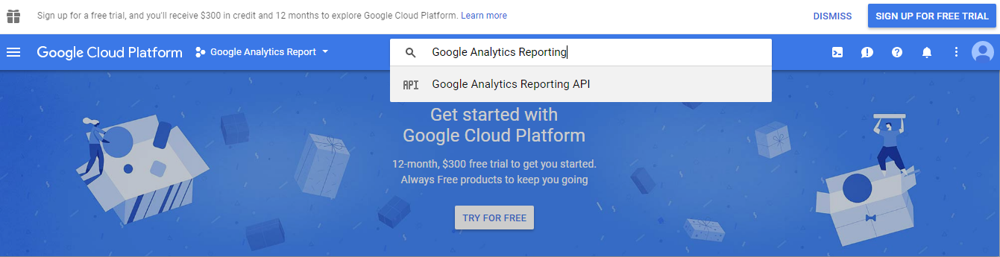
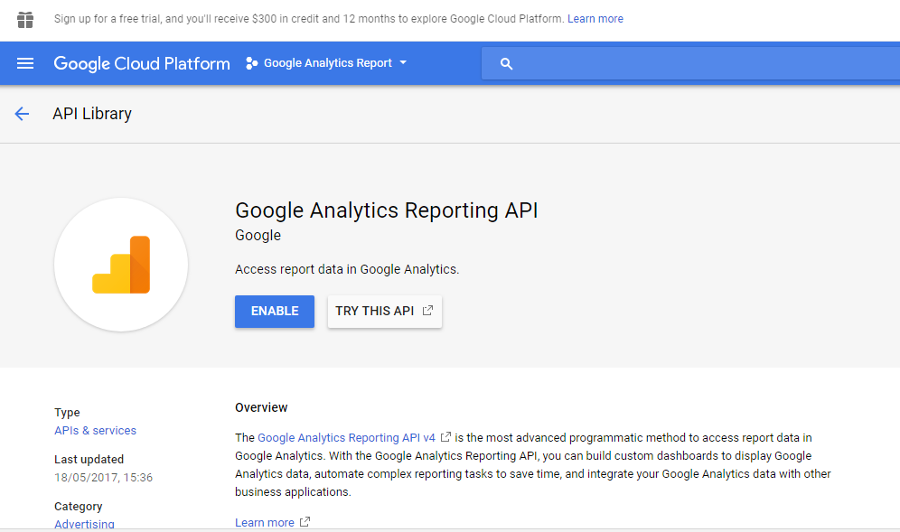
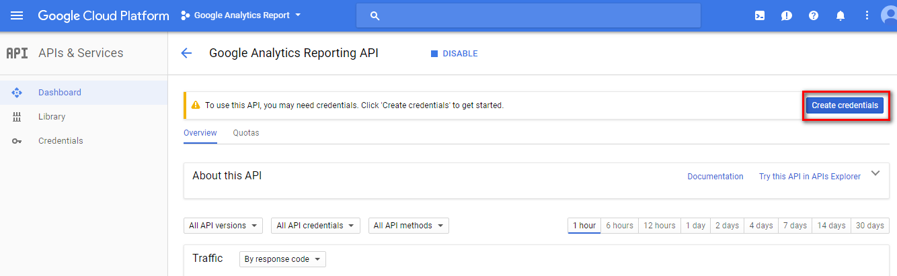
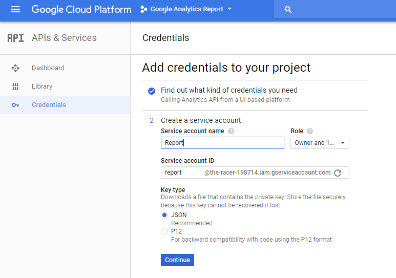
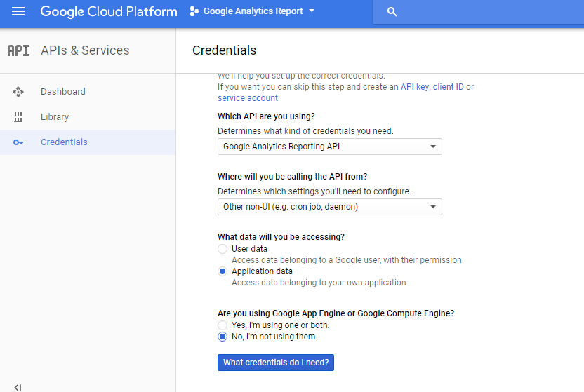
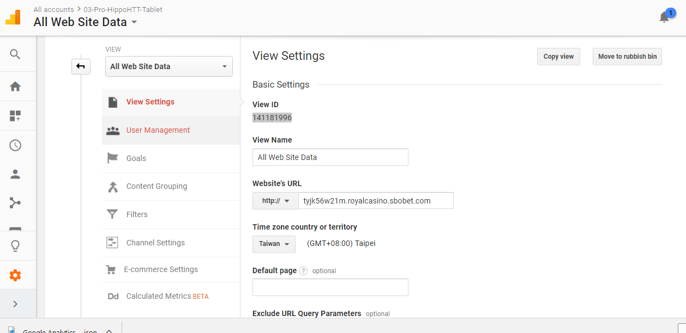
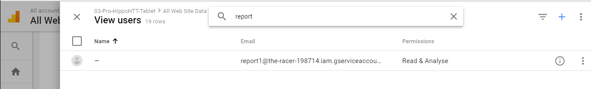

C# Google Analytics Report API

* Login to [Google Developer console](https://console.developers.google.com/apis/dashboard) with your Google account

* Create a new project.

* Go to your project dashboard and then select "Go to APIs overview"

* Click "ENABLE APIS AND SERVICES". It will take you to API library page.

* Search for "analytics" and choose "Google Analytics Reporting API" from results.

* Click "Enable" on API page.

* Add credentials.

"Role" 地方, 選 "Project Owner" 即可

* 到 Google Analytics 網站

記下 ViewID, 並且在 "View Users" 建立 report1 帳號

