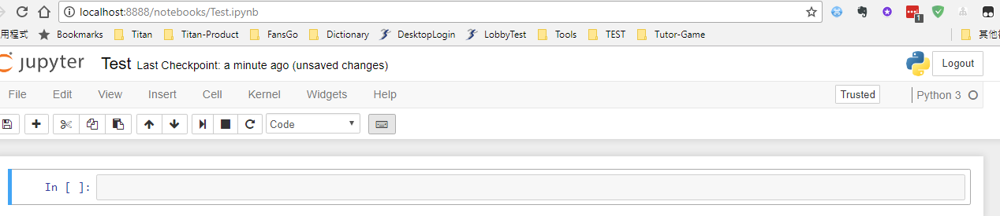
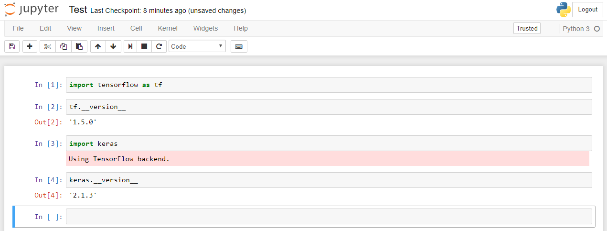

* 下載 [Anaconda](https://www.anaconda.com/download/) Python 虛擬環境工具


啟動Anaconda Prompt , 並建立工作目錄 D:\Demo

```
> conda create --name test python=3.5 anaconda
> conda create --name test python=3.6.2 anaconda
```


這個命令會建立虛擬環境, 
加入anaconda 選項, 它會自動安裝其他Python 套件

啟動/關閉虛擬環境
```
> activate test
> deactivate
```

列出虛擬環境
> conda env list

列出是否有安裝Keras 套件
> conda list keras

安裝Tensorflow CPU 版本 1.5.0
> pip install tensorflow

安裝Keras-2.1.3
> pip install keras

安裝Keras 過程中假如出現下面錯誤
```
TypeError: parse() got an unexpected keyword argument 'transport_encoding'
```

請執行下面指令即可解決
> conda install pip

全部安裝好之後, 啟動虛擬環境之後, 直接執行
> jupyter notebook

就會啟動web 介面, 新增 notebook
* 選取Python 3



在Jupyter Notebook 的Cell (程式儲存格)輸入程式碼
Shift+Enter: 執行後游標移到下一格 
Ctrl+Enter: 執行後游標仍在Cell

在Jupyter Notebook Cell 輸入以下指令
```
> import tensorflow as tf
> tf.__version__
> import keras
> keras.__version__
```


當你要離開時, 記得儲存Notebook

首先匯入相關模組
```
import numpy as np
import pandas as pd
from keras.utils import np_utils
np.random.seed(10)
from keras.datasets import mnist
```

下載mnist 資料
```
(x_train_image, y_train_label), \
(x_test_image, y_test_label) = mnist.load_data()
```

查看資料
```
print('train data=', len(x_train_image))
print(' test data=', len(x_test_image))
```

顯示數字影像
```
import matplotlib.pyplot as plt
def plot_image(image):
	fig = plt.gcf()
	fig.set_size_inches(2, 2)
	plt.imshow(image, cmap='binary')
	plt.show()
```

設定顯示圖形大小
```
fig = plt.gcf()
fig.set_size_inches(2, 2)
```

以黑白灰階顯示
> cmap='binary'

plot_image(x_train_image[0])


想改用Tensorflow GPU 時, 請另外安裝虛擬環境
* 下載 [CUDA Toolkit 9.1](https://developer.nvidia.com/cuda-downloads)


* 下載安裝 [cuDNN](https://developer.nvidia.com/cuDNN) 
v7.0.5 Library for Windows 10

解壓縮會獲得cuda 目錄, 複製cuda 目錄到你喜歡的目錄(C:\Devp\cuDNN),
程式會透過cudnn64_7.dll, 設定windows path加入這個目錄(C:\Devp\cuDNN)

```
> conda create --name testGPU python=3.6.2 anaconda
> activate testGPU
> pip install tensorflow-gpu
> pip install keras
```


