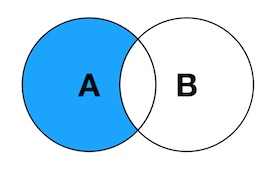
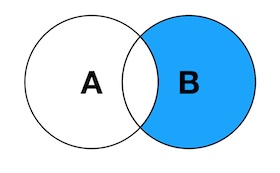
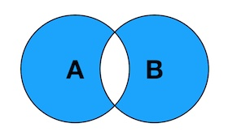

# SQL Joins Syntax

### INNER JOIN & JOIN is same


T-SQL
```
select tb1.* from table1 tb1
INNER JOIN table2 tb2 on tb1.pk = tb2.pk
```

LINQ-Style
```
from tb1 in table1
join tb2 in table2 on tb1.pk equals tb2.pk
select tb1
```

### LEFT JOIN


T-SQL
```
select tb1.* from table1 tb1
LEFT JOIN table2 tb2 on tb1.pk = tb2.pk
```

LINQ-Style
```
from tb1 in table1
join tb2 in table2 on tb1.pk equals tb2.pk into ps
from tb2 in ps.DefaultIfEmpty()
select new { tb1.CategoryName, tb2.ProductName }
```

PS: some other database call "LEFT OUTER JOIN"


### RIGHT JOIN


T-SQL
```
select tb1.* from table1 tb1
RIGHT JOIN table2 tb2 on tb1.pk = tb2.pk
```

LINQ-Style
```
from tb2 in table2
join tb1 in table1 on tb2.pk equals tb1.pk into ps
from tb1 in ps.DefaultIfEmpty()
select new { tb1.CategoryName, tb2.ProductName }
```


### FULL OUTER JOIN


T-SQL
```
select tb1.* from table1 tb1
FULL OUTER JOIN table2 tb2 on tb1.pk = tb2.pk
```

LINQ-Style
```
var leftJoin = from tb1 in table1
	join tb2 in table2 on tb1.pk equals tb2.pk into ps
from tb2 in ps.DefaultIfEmpty()
select new { tb1.CategoryName, tb2.ProductName }

var rightJoin = from tb2 in table2
join tb1 in table1 on tb2.pk equals tb1.pk into ps
from tb1 in ps.DefaultIfEmpty()
select new { tb1.CategoryName, tb2.ProductName }

var result = leftJoin.Union(rightJoin);
```

### LEFT JOIN excluding INNER JOIN



T-SQL
```
SELECT tb1.* FROM Table1 tb1
LEFT JOIN Table2 tb2 ON tb1.PK = tb2.PK 
WHERE tb2.PK IS NULL
```

LINQ-Style
```
from tb1 in table1
join tb2 in table2 on tb1.pk equals tb2.pk into ps
from tb2 in ps.DefaultIfEmpty()
where tb2 == null
select tb1
```

### RIGHT JOIN excluding INNER JOIN



```
SELECT tb2.* FROM Table1 tb1 
RIGHT JOIN Table2 tb2 ON tb1.PK = tb2.PK 
WHERE tb1.PK IS NULL
```

### FULL OUTER JOIN excluding INNER JOIN




```
SELECT tb1.* FROM Table1 tb1
FULL OUTER JOIN Table2 tb2 ON tb1.PK = tb2.PK 
WHERE tb1.PK IS NULL OR tb2.PK IS NULL
```